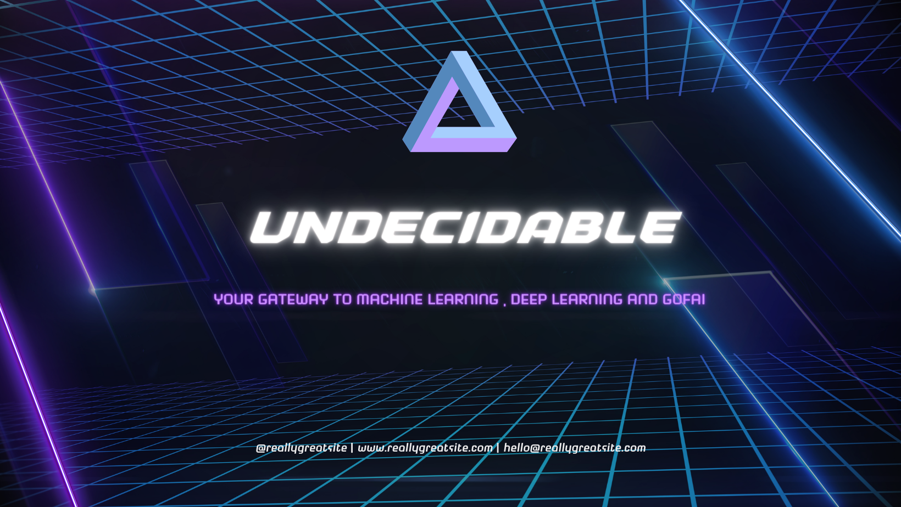

# "The Undecidable" Newsletter Repository

Welcome to the GitHub repository for "The Undecidable" newsletter. This repository serves as the central hub for all the code, content, and resources related to our newsletter. Whether you're a subscriber or a contributor, this README will guide you through the various aspects of our repository.

## About "The Undecidable" Newsletter

"The Undecidable" is a newsletter that explores the fascinating convergence of recursion theory, artificial intelligence, and machine learning in the world of software development. We are dedicated to providing valuable insights, tutorials, and updates that cater to software developers, AI enthusiasts, and mathematicians interested in the intersection of these domains.

## Repository Structure

- **/articles**: This directory contains all the articles that have been featured in our newsletter. You can explore the content we've published, review drafts, or contribute your own articles.

- **/resources**: Find additional resources related to recursion theory, AI, and machine learning, such as code snippets, reference materials, and more.

- **/images**: Store all the images and graphics used in our newsletter here.

- **/contributing**: If you'd like to contribute to "The Undecidable" newsletter, please refer to the guidelines in this directory to learn how to get involved and submit your content.

- **/archive**: Past issues of our newsletter are stored in this directory for reference.

- **/scripts**: Any scripts or automation tools used in our content generation process can be found here.

## Contributing

We welcome contributions from individuals who share our passion for recursion theory, artificial intelligence, and machine learning in the context of software development. If you'd like to contribute articles, code snippets, or resources, please review our [contributing guidelines](contributing/CONTRIBUTING.md).

## Subscribe to "The Recursive Thinker"

If you haven't already, we invite you to [subscribe to our newsletter](https://example.com/newsletter) and join our community of "AI enthusiasts." Stay updated on the latest developments, insights, and news at the intersection of these intriguing fields.

## Contact

If you have any questions, feedback, or suggestions, please feel free to reach out to us via [email@example.com](mailto:email@example.com) or by [creating an issue](https://github.com/yourusername/your-repo/issues) in this repository.

We're excited to have you as part of "The Undecidable" community, and we look forward to exploring the depths of recursion theory, artificial intelligence, and machine learning with you. Happy coding!